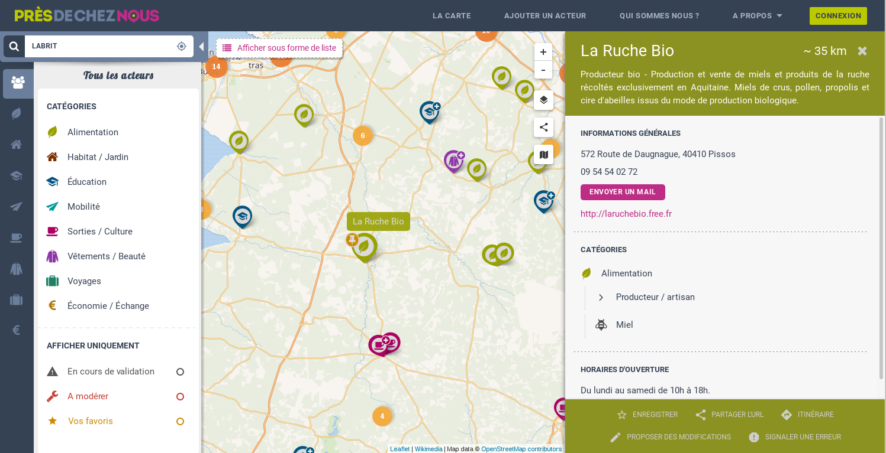

GoGoCarto 
=========

Contact
--------
You can contact us on the channel GoGoCarto at https://chat.lescommuns.org/channel/gogocarto

Overview
--------

GoGoCarto is a full reusable application to create collaborative cartographic directory

The software have been developped for the project ["Près de chez Nous"](https://presdecheznous.fr), consisting on referencing food/education/health/... alternatives in France.

GoGoCarto is highly configurable, and ready to be reused by anyone to create its own map, with its own data, categories, moderation rules, configuration etc...
There is a whole back office to manage data, contents, configuration

[See more screenshot of the backoffice](docs/backoffice-screenshots.md)

GoGoCarto & GoGoCartoJs
------------------

The GoGoCarto project is divided into two separate projects. 

- GoGoCarto repo take care of backend stuff, the form to add new elements, the backoffice, and additonnals pages sucha as homepage
- [GoGoCartoJs](https://github.com/pixelhumain/GoGoCartoJs) an autonomous javascript library responsible for data vizualisation (map, list, categories, search...). [See the online full documentation](https://pixelhumain.github.io/GoGoCartoJs)

Stack
-----

Symfony2, Twig templates, SASS, MaterializeCSS, Javascript, Gulp

Documentation
-------------

- [Installation intructions](docs/installation.md)
- [Project structure](docs/project-structure.md)
- [Coding conventions](docs/coding-conventions.md)
- [How to contribute](docs/contributing.md)
