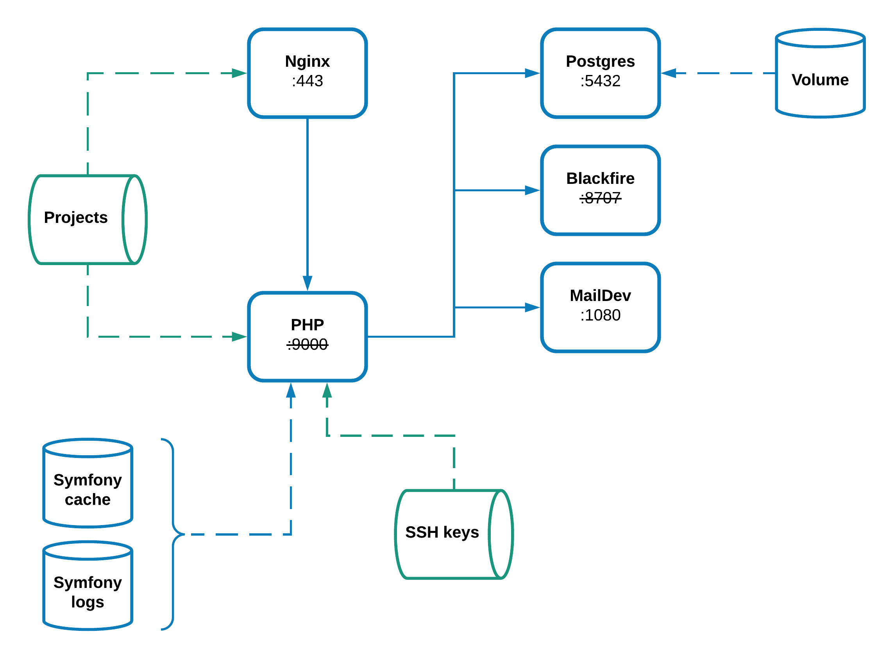

# Docker for Symfony 
This repository allows the creation of a Docker environment that meets
[Symfony requirements](https://symfony.com/doc/current/reference/requirements.html).

**What you will find here is an environment designed to simplify the development workflow when working with a Symfony
application. Thus, some services or configurations are not suitables for a production usage.**

## Architecture

## Services
* `blackfire`: [blackfire/blackfire:latest](https://hub.docker.com/r/blackfire/blackfire/) image (application profiling).
* `maildev`: [djfarrelly/maildev:latest](https://hub.docker.com/r/djfarrelly/maildev/) (emails testing).
* `nginx`: [nginx:1.15-alpine](nginx/Dockerfile) custom image with HTTPS (web server).
* `php`: [php:7.2-fpm-alpine](php/Dockerfile) custom image with additional extensions and Composer.
* `postgres`: [postgres:10-alpine](https://hub.docker.com/_/postgres/) image (database).

And more to come...

## Documentation
> In order to make things more readable, and maintainable, the documentation has been migrated to
the [repository Wiki](https://github.com/ajardin/docker-symfony/wiki). Where you will find all details about the 
installation process along the available instructions for the day-to-day work. 
